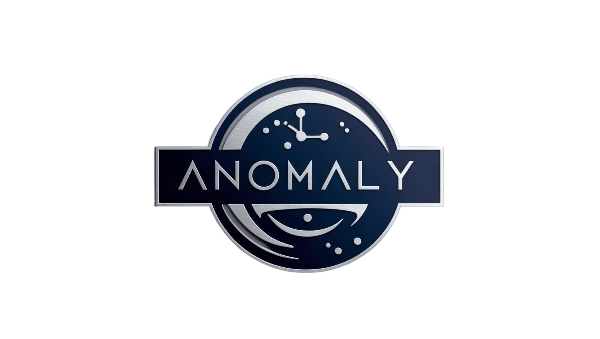

# Anomaly Editor

<p align="center">
  
</p>

<p align="center">
  A sleek, modern Markdown editor with dark theme and integrated file explorer.
</p>

<p align="center">
  <a href="#key-features">Key Features</a> •
  <a href="#installation">Installation</a> •
  <a href="#released-builds">Released Builds</a> •
  <a href="#usage">Usage</a> •
  <a href="#development">Development</a> •
  <a href="#build">Build</a> •
  <a href="#project-structure">Project Structure</a> •
  <a href="#technologies">Technologies</a> •
  <a href="#contributing">Contributing</a> •
  <a href="#license">License</a>
</p>

<p align="center">
  
</p>

<p align="center">
  
</p>

## Key Features

- 🌙 **Dark Theme** - Easy on the eyes with a modern dark interface
- 📁 **Integrated File Explorer** - Browse and manage your file structure
- 📝 **Markdown Editor** - Write in Markdown with syntax highlighting
- 👁️ **Live Preview** - See your rendered Markdown in real-time
- 🔄 **Autosave** - Never lose your work with automatic saving
- ⚡ **Keyboard Shortcuts** - Boost productivity with keyboard shortcuts
- 💻 **Cross-Platform** - Works on Windows, macOS, and Linux
- 📦 **Portable** - No installation required (Windows portable version available)

## Installation

### Pre-built Binaries

Download the latest version for your platform:

#### Windows

- **Portable Version**: Extract the ZIP file and run `Anomaly.exe` directly
- **Installer**: Run the installer and follow the prompts

#### From Source

```bash
# Clone the repository
git clone https://github.com/Caibran/Anomaly.git

# Navigate to the project directory
cd Anomaly

# Install dependencies
npm install

# Run the application in development mode
npm start
```

## Released Builds

You can download the latest release of Anomaly Editor from the following link:

- [Download Latest Release](https://github.com/Caibran/Anomaly/releases)

Available packages:
- **Windows Portable**: Just extract and run, no installation needed
- **Windows Installer**: Full installation with start menu shortcuts

## Usage

1. **Getting Started**
   - Launch the application
   - Click "Open Folder" in the File menu (or press Ctrl+O)
   - Select a directory to work with

2. **Working with Files**
   - Navigate through your files in the explorer sidebar
   - Click on a file to open it in the editor
   - Create new files with the "Create New" button or Ctrl+N
   - Edit and save with Ctrl+S

3. **Markdown Features**
   - Write standard Markdown syntax
   - See instant preview of your rendered content
   - Format text with shortcuts (bold, italic, lists, headings)

## Development

### Prerequisites

- Node.js (v14 or higher)
- npm (v6 or higher)

### Setup Development Environment

```bash
# Install dependencies
npm install

# Start development server
npm start
```

This will start both the React development server and the Electron application.

## Build

### Creating Distributable Packages

```bash
# Build React app and package as an executable
npm run build-dist

# The packaged application will be in the dist/ directory
# A ZIP file will also be created for easy distribution
```

### Available Build Scripts

- `npm run build` - Build the React application
- `npm run package-win` - Package as Windows executable with icon
- `npm run package-simple` - Package as Windows executable (simplified)
- `npm run create-zip` - Create a distributable ZIP file
- `npm run build-dist` - Complete build pipeline (build, package, zip)

## Project Structure

```
anomaly/
├── assets/               # Application assets (icons, images)
├── build/                # Built React application
├── dist/                 # Packaged application
├── node_modules/         # Dependencies
├── public/               # Public assets for React
├── scripts/              # Build scripts
│   ├── create-zip.js     # Script to create distributable ZIP
├── src/                  # React source code
│   ├── components/       # React components
│   ├── styles/           # CSS and styled-components
│   ├── App.js            # Main React application
│   └── index.js          # React entry point
├── electron-builder-config.js  # Electron builder configuration
├── launch.bat            # Batch file to launch application
├── main.js               # Electron development entry point
├── package.json          # Project dependencies and scripts
├── preload.js            # Electron preload script
├── standalone-main.js    # Electron production entry point
└── README.md             # Project documentation
```

## Technologies

- **Frontend**:
  - React 19
  - Styled Components
  - React Icons
  - React Markdown
  
- **Backend**:
  - Electron 35
  - Node.js File System API
  
- **Build Tools**:
  - Electron Packager
  - Electron Builder
  - React Scripts

## Contributing

Contributions are welcome! Here's how you can contribute:

1. Fork the repository
2. Create a new branch (`git checkout -b feature/amazing-feature`)
3. Make your changes
4. Commit your changes (`git commit -m 'Add some amazing feature'`)
5. Push to the branch (`git push origin feature/amazing-feature`)
6. Open a Pull Request

Please ensure your code follows the existing style and includes appropriate documentation.

## License

This project is licensed under the ISC License - see the LICENSE file for details.

---

<p align="center">
  Made with ❤️ by Caibran
</p> 